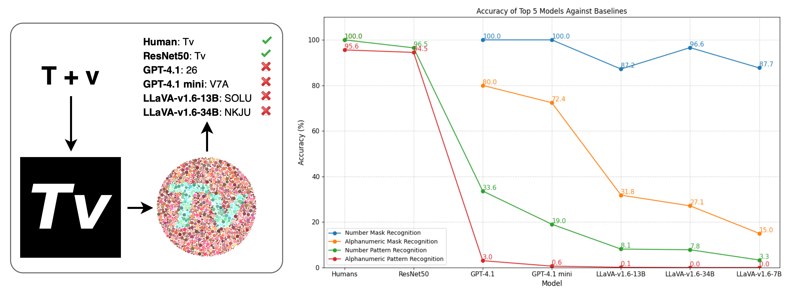

## HueManity: Probing Fine-Grained Visual Perception in MLLMs

This repository accompanies the research paper:

Dataset available in [Huggingface HueManity](https://huggingface.co/datasets/Jayant-Sravan/HueManity)

**HueManity: Probing Fine-Grained Visual Perception in MLLMs (arxiv)**

Rynaa Grover*, Jayant Tamarapalli*, Sahiti Yerramilli*, and Nilay Pande*, *equal contributions.



<p align="justify">
Multimodal Large Language Models (MLLMs) demonstrate strong high-level visual reasoning, yet their foundational understanding of nuanced perceptual details is often overlooked by existing evaluations. To address this, we introduce HueManity, a novel benchmark specifically designed to assess this crucial dimension of MLLM visual understanding. HueManity comprises 83,850 Ishihara-style images with embedded alphanumeric strings, challenging models on precise pattern recognition - a fundamental aspect of visual understanding. Our evaluation of nine MLLMs reveals a profound performance deficit: the best-performing model achieved only 33.6% accuracy on an 'easy' numeric task and 3% on a 'hard' alphanumeric task. This starkly contrasts with human (100% numeric, 95.6% alphanumeric) and fine-tuned ResNet50 (96.5% numeric, 94.5% alphanumeric) performance. These findings uncover a critical gap in MLLMs' fine-grained visual understanding, a limitation not apparent through conventional high-level assessments. HueManity offers a new paradigm for evaluating this specific type of model understanding.
</p>

## Getting Started

We recommend setting up a virtual environment using conda, the `huemanity` package can be installed via:

```bash
conda env create -f huemanity.yml
conda activate huemanity
```

### Running from commandline

We provide a script to directly run the data generation pipeline for all two character alphanumerics:
```bash
python main.py
```

## Citation

If you find our work useful, please cite the following paper:

```bibtex
TBD
```

## License
This sample code is released under the [LICENSE](LICENSE) terms.
